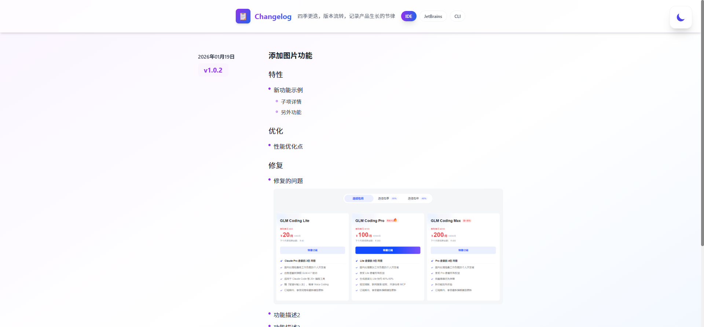
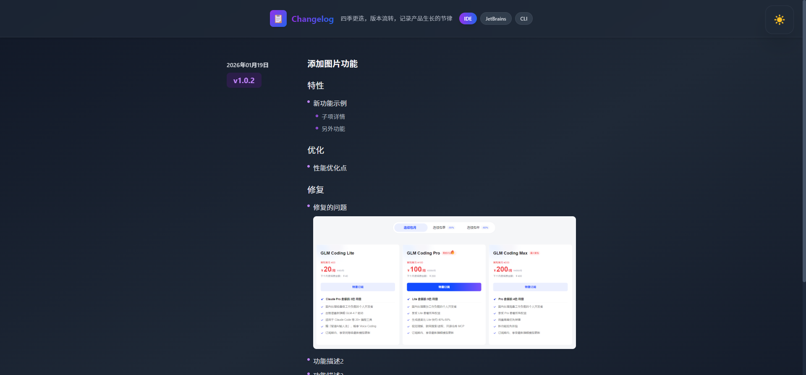
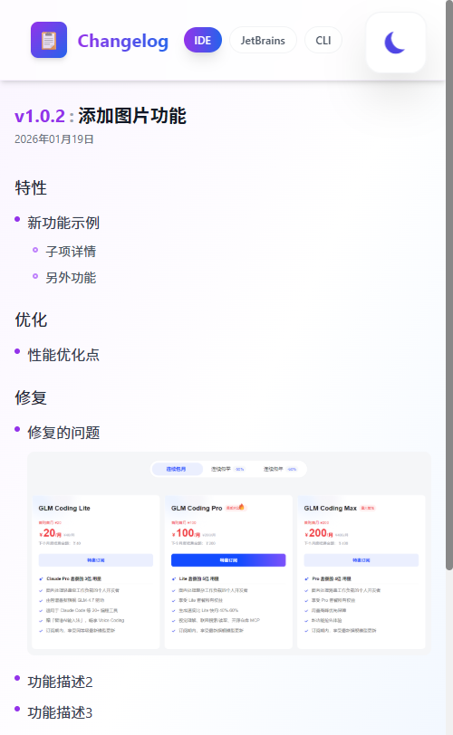
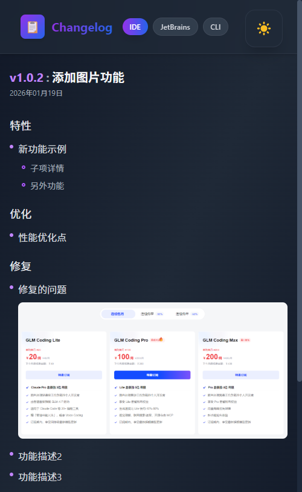
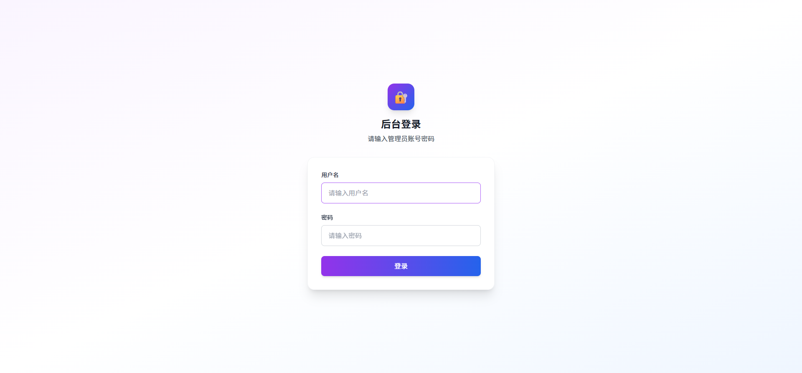
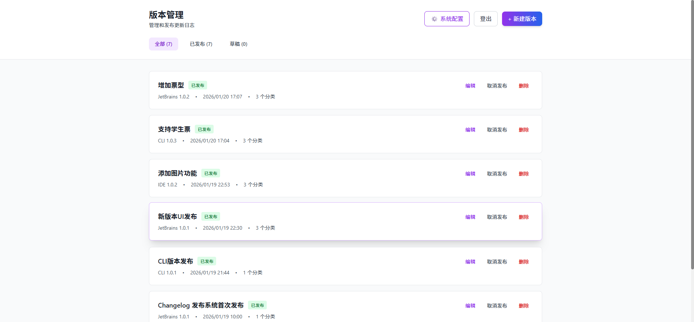
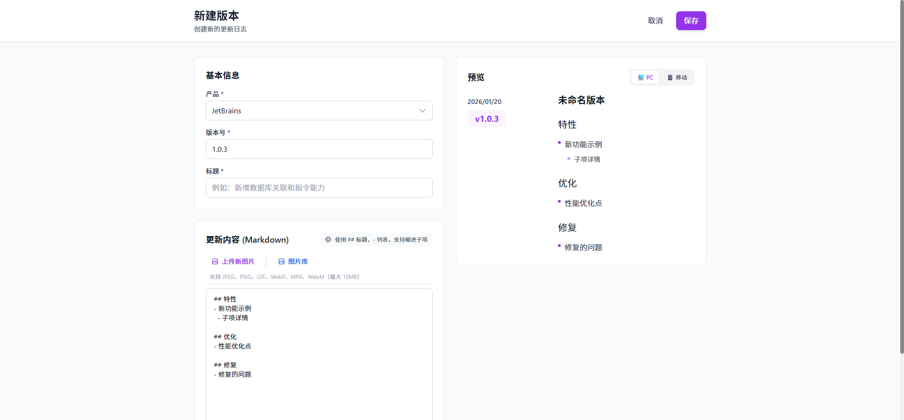
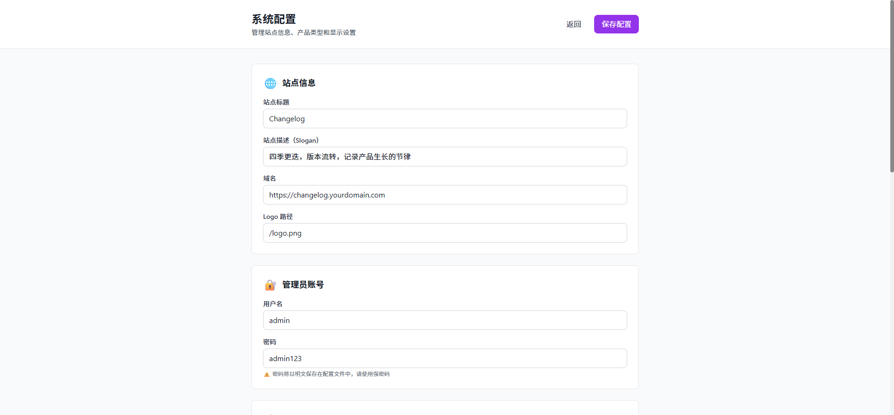

# Changelog System

<div align="center">

**A modern changelog publishing platform with multi-product support, Markdown editor, and dark theme**

[](https://nextjs.org/)
[](https://reactjs.org/)
[](https://www.typescriptlang.org/)
[](https://tailwindcss.com/)

[English](#english) | [简体中文](#简体中文)

</div>

---

## 简体中文

一个现代化的 Changelog 发布系统，支持多产品管理、Markdown 编辑器和暗色主题。

### ✨ 特性

- 🎨 **现代化 UI** - 精美的渐变设计，流畅的动画效果
- 🌙 **暗色主题** - 支持明暗主题切换，自动保存偏好
- 📦 **多产品支持** - 统一管理多个产品的更新日志
- ✍️ **Markdown 编辑** - 实时预览，支持标题、列表、嵌套、图片
- 🖼️ **图片管理** - 内置图片选择器，支持灯箱预览
- ⚙️ **动态配置** - 配置修改实时生效，无需重新编译
- 🔐 **后台管理** - 安全的管理员登录和版本管理
- 📱 **响应式设计** - 完美适配桌面和移动设备
- ⚡ **静态部署** - 导出纯静态文件，支持任意服务器托管

### 🛠️ 技术栈

- **框架**: [Next.js 14](https://nextjs.org/) (App Router)
- **UI**: [React 18](https://reactjs.org/) + [TypeScript](https://www.typescriptlang.org/)
- **样式**: [Tailwind CSS](https://tailwindcss.com/)
- **编辑器**: [TipTap](https://tiptap.dev/)
- **部署**: 静态导出 (Static Export)

### 📸 截图预览

#### 前台展示

<table>
  <tr>
    <td></td>
    <td></td>
  </tr>
  <tr>
    <td align="center">亮色主题</td>
    <td align="center">暗色主题</td>
  </tr>
  <tr>
    <td></td>
    <td></td>
  </tr>
  <tr>
    <td align="center">移动端（亮色）</td>
    <td align="center">移动端（暗色）</td>
  </tr>
</table>

#### 后台管理

<table>
  <tr>
    <td></td>
    <td></td>
  </tr>
  <tr>
    <td align="center">登录页</td>
    <td align="center">版本列表</td>
  </tr>
  <tr>
    <td></td>
    <td></td>
  </tr>
  <tr>
    <td align="center">Markdown 编辑器</td>
    <td align="center">系统配置</td>
  </tr>
</table>

### 📦 安装

```bash
# 克隆项目
git clone https://github.com/your-username/changelog-system.git
cd changelog-system

# 安装依赖
npm install

# 启动开发服务器
npm run dev
```

访问 http://localhost:3000 查看页面，http://localhost:3000/admin 进入后台。

### 🚀 构建与部署

```bash
# 构建静态文件
npm run build

# 本地预览构建结果
npm run preview

# 部署到远程服务器（需配置 scripts/deploy-ssh.js）
npm run deploy:full

# 部署到本地目录
npm run deploy:local:full
```

### 📁 项目结构

```
changelog-system/
├── app/                      # Next.js App Router
│   ├── admin/               # 后台管理页面
│   │   ├── login/           # 登录页
│   │   ├── page.tsx         # 管理首页
│   │   └── config/          # 配置页
│   ├── api/                 # API 路由
│   │   ├── auth/            # 认证中间件
│   │   ├── config/          # 配置管理
│   │   ├── login/           # 登录接口
│   │   ├── versions/        # 版本管理
│   │   └── images/          # 图片上传
│   └── page.tsx             # 首页
├── components/              # React 组件
│   ├── ChangelogClient.tsx  # 前端主组件
│   ├── VersionEditor.tsx    # 版本编辑器
│   ├── ImagePicker.tsx      # 图片选择器
│   ├── ThemeProvider.tsx    # 主题提供者
│   └── ThemeToggle.tsx      # 主题切换按钮
├── lib/                     # 工具库
│   ├── data.ts              # 数据读取
│   └── config.ts            # 配置工具
├── data/                    # 数据目录
│   ├── config.json          # 系统配置
│   ├── versions.json        # 版本数据
│   └── images/              # 图片资源
└── public/                  # 静态资源
```

### ⚙️ 配置

访问 `/admin/config` 修改系统配置：

- **站点信息**: 标题、描述、域名、Logo
- **管理员账号**: 用户名、密码
- **产品类型**: 添加/编辑/删除产品，设置图标和排序
- **显示设置**: 每页版本数、日期格式

配置保存后刷新页面即可生效。

### 📝 使用说明

1. **添加版本更新**
   - 登录后台 `/admin`
   - 点击"添加新版本"
   - 选择产品、填写版本号和标题
   - 使用 Markdown 语法编辑更新内容
   - 支持添加功能特性、优化、修复等分类

2. **Markdown 语法**
   - `## 标题` - 二级标题（用于分类）
   - `- 列表项` - 一级列表
   - `  - 缩进列表` - 二级子项
   - `` - 插入图片

### 📄 许可证

MIT License

---

## English

A modern changelog publishing platform with multi-product support, Markdown editor, and dark theme.

### ✨ Features

- 🎨 **Modern UI** - Beautiful gradient design with smooth animations
- 🌙 **Dark Theme** - Toggle between light and dark modes with auto-save
- 📦 **Multi-Product** - Manage changelogs for multiple products in one place
- ✍️ **Markdown Editor** - Real-time preview, supports headings, lists, nesting, images
- 🖼️ **Image Management** - Built-in image picker with lightbox preview
- ⚙️ **Dynamic Config** - Configuration changes take effect immediately without recompilation
- 🔐 **Admin Panel** - Secure admin login and version management
- 📱 **Responsive Design** - Perfect for desktop and mobile devices
- ⚡ **Static Deployment** - Export to static files, host on any server

### 🛠️ Tech Stack

- **Framework**: [Next.js 14](https://nextjs.org/) (App Router)
- **UI**: [React 18](https://reactjs.org/) + [TypeScript](https://www.typescriptlang.org/)
- **Styling**: [Tailwind CSS](https://tailwindcss.com/)
- **Editor**: [TipTap](https://tiptap.dev/)
- **Deployment**: Static Export

### 📦 Installation

```bash
# Clone the repository
git clone https://github.com/your-username/changelog-system.git
cd changelog-system

# Install dependencies
npm install

# Start development server
npm run dev
```

Visit http://localhost:3000 for the homepage, http://localhost:3000/admin for the admin panel.

### 🚀 Build & Deploy

```bash
# Build static files
npm run build

# Preview build locally
npm run preview

# Deploy to remote server (configure scripts/deploy-ssh.js first)
npm run deploy:full

# Deploy to local directory
npm run deploy:local:full
```

### 📁 Project Structure

```
changelog-system/
├── app/                      # Next.js App Router
│   ├── admin/               # Admin pages
│   ├── api/                 # API routes
│   └── page.tsx             # Homepage
├── components/              # React components
├── lib/                     # Utility libraries
├── data/                    # Data directory
│   ├── config.json          # System config
│   ├── versions.json        # Version data
│   └── images/              # Image assets
└── public/                  # Static assets
```

### ⚙️ Configuration

Visit `/admin/config` to modify system settings:

- **Site Info**: Title, description, domain, logo
- **Admin Account**: Username, password
- **Product Types**: Add/edit/delete products with icons and ordering
- **Display Settings**: Items per page, date format

Configuration changes take effect immediately after refreshing the page.

### 📝 Usage

1. **Add Version Update**
   - Login to admin panel at `/admin`
   - Click "Add New Version"
   - Select product, enter version number and title
   - Edit content using Markdown syntax
   - Supports categories: Features, Improvements, Fixes

2. **Markdown Syntax**
   - `## Heading` - Level 2 heading (for categories)
   - `- List item` - Level 1 list
   - `  - Nested item` - Level 2 nested item
   - `` - Insert image

### 📄 License

MIT License
